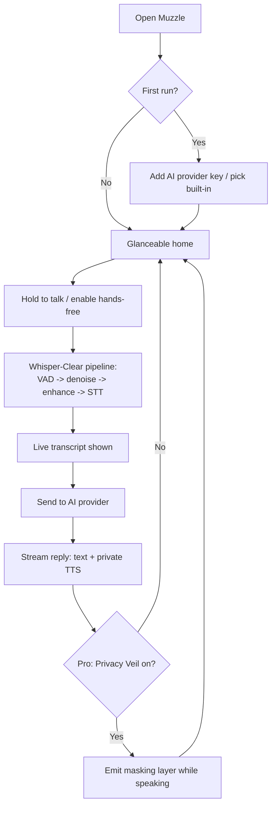

# Muzzle — Product Requirements Document (PRD)

> **Tagline:** _"Talk to your A.I., not your neighbor."_

---

## 0. Open Decisions / Assumptions

These were defaulted because they weren't yet confirmed. Override any of them and the rest of the doc adapts.

| # | Decision | Default chosen | Why |
|---|----------|----------------|-----|
| D1 | Platform / stack | **Astro web app shipped as an installable PWA** (Astro static shell + interactive islands), deployed on Vercel | One codebase that runs on any phone/desktop browser, no app-store gatekeeping, instant updates; the core moment ("talking to AI in public") still works great on mobile web |
| D2 | Core privacy mechanism | **Two layers:** (1) _Whisper-Clear_ input + (2) _Privacy Veil_ acoustic masking. MVP ships Whisper-Clear; masking is fast-follow | Whisper-Clear delivers the value alone; masking is the "wow" upsell |
| D3 | What "your A.I." is | **BYOK** (bring-your-own-key) to LLM providers via a built-in chat + voice UI, with OpenAI Realtime for low-latency voice | No vendor lock-in, cheapest path to launch, power-user friendly |
| D4 | Business model | Freemium: free tier (limited daily whisper minutes), Pro subscription unlocks masking + unlimited + premium voices | Standard, validated SaaS motion |

---

## 1. Summary

**Muzzle** lets people talk to their AI assistant out loud *without* broadcasting it to everyone around them. You speak in a near-silent whisper; Muzzle cleans and amplifies that whisper into crystal-clear input for your AI, and (Pro) emits a subtle masking layer so bystanders can't make out your words. It turns the cafe, open-plan office, train, and shared apartment into places where voice-AI is socially acceptable.

## 2. Problem

Voice is the fastest, most natural interface to modern AI — but almost nobody uses it in public. Talking to an assistant out loud feels embarrassing, leaks private/work content to neighbors, and is disruptive in shared spaces. So people fall back to typing, losing voice's speed and hands-free benefit. There is no socially-acceptable way to use voice AI around other humans.

## 3. Goals & Non-Goals

### Goals
- Let a user dictate to / converse with their AI at **whisper volume** and still get accurate results.
- Make voice-AI feel **socially invisible** in shared spaces.
- Be **provider-agnostic** so users keep their preferred AI.
- Sub-second perceived latency for the voice loop.

### Non-Goals (v1)
- Not building our own foundation model.
- Not a general-purpose call/meeting app.
- Not offline-first (cloud STT/LLM acceptable at launch; an offline app shell ships via the PWA, but the AI loop needs a network).
- Not a native app at launch (web-only PWA; works in the browser with the device mic + AirPods/Bluetooth). Native wrappers are a later option.

## 4. Target Users / Personas

1. **The Open-Office Knowledge Worker** — wants to dictate prompts/code/emails to AI without coworkers overhearing client or salary talk.
2. **The Commuter** — uses AI hands-free on trains/buses but won't speak at normal volume around strangers.
3. **The Shared-Space Liver** — roommates, thin walls, sleeping partner/kids; wants late-night AI use without being heard.
4. **The Privacy-Conscious Power User** — already BYOK to LLMs, cares about not leaking sensitive prompts acoustically.

## 5. Core Concepts / Features

### 5.1 Whisper-Clear (MVP, the heart of the product)
- Capture very low-volume / whispered / sub-vocalized speech.
- On-capture pipeline: VAD (voice activity detection) → noise suppression → gain/enhancement → robust STT tuned for quiet speech.
- Output: accurate transcript fed to the AI; visible live transcript so the user trusts it.
- Push-to-talk and hands-free (VAD) modes.

### 5.2 Privacy Veil — Acoustic Masking (Pro, fast-follow)
- While you speak, the phone/earbuds emit a low, unobtrusive masking layer (informational masking: babble/pink-noise blend) so nearby people can't parse your words.
- User-adjustable intensity; auto-ducks when you stop talking.
- Clear UX that this masks *bystanders*, not a guarantee of acoustic secrecy.

### 5.3 Your AI, Connected (MVP)
- BYOK to OpenAI / Anthropic / others via a unified provider layer.
- Built-in chat + voice UI; conversation history.
- OpenAI Realtime API path for true low-latency back-and-forth voice; STT+LLM+TTS fallback path for providers without realtime.
- Spoken responses played privately (earbuds preferred; on-speaker warns the user).

### 5.4 Discretion UX (MVP)
- One-tap "muzzle on" from a minimal, glanceable UI (works one-handed, screen-dimmed friendly).
- Installable PWA: add-to-home-screen, full-screen standalone display, persisted mic permission.
- Optional haptic-only confirmations (Vibration API where supported) so you don't need to look.
- AirPods/Bluetooth-first audio routing.

### 5.5 Accounts, Limits, Billing (MVP-lite)
- Anonymous local use to start; account for sync + subscription.
- Free tier: capped daily whisper minutes. Pro: unlimited + Privacy Veil + premium voices.

## 6. User Flows (happy path)

## 7. Requirements

### Functional
- FR1: Capture audio at whisper SPL and produce usable STT with target accuracy (see metrics).
- FR2: Live, low-latency transcript display.
- FR3: BYOK storage in device secure storage; never log raw keys.
- FR4: Streamed AI responses (text + optional voice).
- FR5: Push-to-talk and VAD hands-free modes.
- FR6 (Pro): Acoustic masking output with intensity control and auto-duck.
- FR7: Conversation history with delete/clear.
- FR8: Subscription purchase + entitlement gating.

### Non-Functional
- NFR1: Perceived voice-loop latency < ~1s to first response token (realtime path).
- NFR2: Privacy: prompts/audio not retained server-side beyond what's needed to relay; clear data policy.
- NFR3: Battery: continuous 15-min session without thermal throttling on a mid-tier phone.
- NFR4: Accessibility: full one-handed + screen-reader support.

## 8. Success Metrics
- **Whisper STT accuracy** (WER) at whisper volume vs. normal volume baseline.
- **Activation:** % of new users who complete a first whisper-to-AI exchange.
- **Public-use rate:** sessions detected in noisy/public contexts.
- **Pro conversion:** free → Pro, with Privacy Veil as the primary driver.
- **Retention:** D7 / D30.
- Qualitative: "I used voice AI somewhere I never would have before."

## 9. Privacy & Trust (load-bearing for this product)
- On-device processing where feasible; minimize what leaves the device.
- Explicit, honest framing of masking: it reduces intelligibility to bystanders; it is not encryption.
- Transparent BYOK: user data flows to *their* chosen provider under that provider's terms.
- No selling data; no training on user audio.

## 10. Risks & Mitigations
| Risk | Mitigation |
|------|-----------|
| Whisper STT accuracy too low | Lead with enhancement + provider STT tuned for quiet speech; benchmark early; allow quick correction UI |
| Masking annoys the user / leaks | Earbud-first, subtle defaults, intensity control, honest claims |
| Latency feels slow | Realtime API path, streaming everywhere, optimistic UI |
| BYOK friction at onboarding | Offer a built-in metered option as fallback |
| Battery/thermal | Cap session length, efficient audio graph, on-device VAD gating |

## 11. Phased Roadmap
- **Phase 0 — Prototype:** Astro app with Whisper-Clear pipeline + BYOK chat (push-to-talk) using browser mic capture and an Astro STT endpoint. Validate whisper STT accuracy.
- **Phase 1 — MVP:** Installable PWA, hands-free VAD, realtime voice loop (AI SDK on Vercel), history, accounts, free/Pro gating.
- **Phase 2 — Privacy Veil:** Acoustic masking via Web Audio (Pro), premium voices.
- **Phase 3 — Expansion:** On-device STT/VAD (WASM), desktop-optimized layout, optional native wrapper (Capacitor/Tauri), deeper integrations.

## 12. Out of Scope (for now)
Meeting transcription, multi-party calls, custom model training, hardware accessories.
