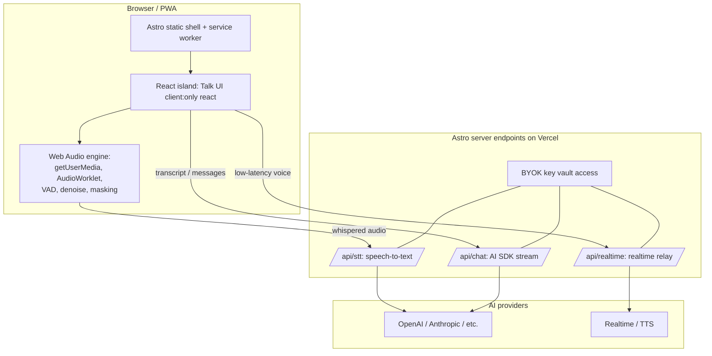

# Muzzle — Tech Stack

> Web-first. **Astro** is the primary framework; Muzzle ships as an installable **PWA** deployed on **Vercel**. This document is the authoritative stack reference; [PRD.md](PRD.md) and [AGENTS.md](AGENTS.md) defer to it.

---

## 1. High-level architecture



**Principle:** the browser handles capture, enhancement, and masking; Astro server endpoints hold all secrets and broker AI calls; nothing sensitive ships to the client.

---

## 2. Core framework — Astro

- **Astro** as the application framework. Static-by-default pages with **interactive islands** for the voice UI. JS is only shipped for components marked with a `client:*` directive, keeping the app fast and the shell light.
- **Rendering mode:** `output: 'server'` (on-demand rendering) so we get live API endpoints, with static marketing/legal pages opted back in via `export const prerender = true`.
- **Adapter:** [`@astrojs/vercel`](https://docs.astro.build/en/guides/integrations-guide/vercel/) — required for server endpoints and SSR on Vercel. Added via `npx astro add vercel`.

### Hydration directives we use
| Directive | Where |
|-----------|-------|
| `client:load` | The primary "hold/tap to talk" control (must be interactive immediately) |
| `client:idle` / `client:visible` | Secondary panels (settings, history, masking controls) |
| `client:only="react"` | Any component that touches `AudioContext` / `navigator.mediaDevices` and cannot server-render |

> Note: components using browser-only audio APIs must be `client:only` (or guard all browser API access) so they never run during SSR.

---

## 3. UI islands — React

- **React** as the islands framework via `@astrojs/react`. (Svelte/Solid are viable alternatives Astro supports; React chosen for ecosystem + AI SDK React hooks.)
- **Styling:** Tailwind CSS via `@astrojs/tailwind` (or the Vite Tailwind plugin). Optional shadcn/ui-style primitives for the chat/settings surfaces.
- **State:** lightweight store (Zustand or nanostores — nanostores integrates cleanly across Astro islands) for session/talk state shared between islands.

---

## 4. Audio pipeline (browser)

All in `src/lib/audio/`, framework-agnostic so islands just call into it.

- **Capture:** `navigator.mediaDevices.getUserMedia({ audio: ... })` with echo cancellation / noise suppression / auto-gain constraints tuned for quiet speech; `MediaRecorder` or raw `AudioWorklet` taps for streaming.
- **Processing graph:** `AudioContext` + `AudioWorkletNode` for low-latency DSP:
  - **VAD** (voice activity detection) to gate hands-free mode.
  - **Noise suppression / enhancement** (WASM model, e.g. RNNoise-class, runs in the worklet).
  - Gain/normalization to lift whispered input.
- **Whisper-Clear output:** enhanced audio streamed to `/api/stt`, or sent through the realtime relay.
- **Privacy Veil (masking):** a separate `AudioContext` output graph plays an informational-masking layer (babble/pink-noise blend) through the speaker/earbuds while the user talks, with intensity control and auto-duck on silence.
- **Routing:** prefer Bluetooth/AirPods output; warn when on the loudspeaker.
- Requires a **secure context** (https or `localhost`) for mic access.

---

## 5. AI integration — Vercel AI SDK

- **Vercel AI SDK** (`ai` + provider packages such as `@ai-sdk/openai`, `@ai-sdk/anthropic`) for text generation, tool calls, and streaming.
- Called exclusively from **Astro server endpoints** in `src/pages/api/`:
  - `POST /api/chat` — streams LLM responses (AI SDK streaming → streamed `Response` body).
  - `POST /api/stt` — speech-to-text for whispered audio.
  - `/api/realtime` — relay/broker for low-latency realtime voice (e.g. OpenAI Realtime), keeping the provider key server-side.
- **BYOK:** users bring their own provider keys; keys are stored in per-user secure storage / env and used only inside endpoints. Optional **Vercel AI Gateway** for unified routing/failover/cost tracking across providers.
- **Provider strategy:** realtime path for low-latency voice loops; STT + LLM + TTS fallback for providers without realtime.

Example endpoint shape (Astro server endpoint returning a streamed `Response`):

```ts
// src/pages/api/chat.ts
export const prerender = false;
import type { APIRoute } from "astro";

export const POST: APIRoute = async ({ request }) => {
  const { messages } = await request.json();
  // ...call Vercel AI SDK streamText with a server-side key...
  // return the AI SDK streamed Response
  return new Response(/* stream */);
};
```

---

## 6. PWA / installability

- **`@vite-pwa/astro`** for the web app manifest + service worker (Astro has no built-in PWA; this is the standard integration).
- Manifest: standalone display, icons, name/short_name, theme color.
- Service worker: cache the **app shell** for offline launch (the live AI loop still needs network).
- Mic permission handled at runtime on user gesture; persisted by the browser for installed PWAs.

---

## 7. Hosting & platform — Vercel

- Deploy via `@astrojs/vercel`; preview deployments per PR, production promotion on merge.
- **Env vars** managed in Vercel (provider keys, gateway config); pulled locally with `vercel env pull`. Never expose secrets via `PUBLIC_` vars.
- Optional: **Vercel storage** (e.g. Postgres/KV via Marketplace) for accounts, history, and subscription entitlements when we add them.

---

## 8. Auth, accounts, billing (later phases)

- Auth via a Vercel-friendly provider (Clerk on the Marketplace, or similar) — only when accounts land in Phase 1.
- Subscription/entitlement gating for Pro (Privacy Veil, unlimited minutes, premium voices).

---

## 9. Language, tooling, quality

- **TypeScript** strict across `.astro` / `.ts` / `.tsx`.
- `astro check` for type/diagnostics; ESLint + Prettier.
- Suggested project layout:

```
src/
  pages/
    index.astro            # app shell (static) + Talk island
    api/
      chat.ts              # AI SDK streaming endpoint
      stt.ts               # speech-to-text
      realtime.ts          # realtime relay
  components/
    TalkButton.tsx         # client:load React island
    MaskingControls.tsx    # client:idle
    Conversation.tsx
  lib/
    audio/                 # capture, VAD, denoise, masking (framework-agnostic)
    ai/                    # provider glue (server-only)
  types/
public/                    # manifest, icons, static assets
astro.config.mjs           # integrations: react, tailwind, vercel, vite-pwa
```

---

## 10. Key dependencies (indicative)

| Concern | Package |
|---------|---------|
| Framework | `astro` |
| Vercel adapter | `@astrojs/vercel` |
| React islands | `@astrojs/react`, `react`, `react-dom` |
| Styling | `@astrojs/tailwind`, `tailwindcss` |
| Cross-island state | `nanostores` (or `zustand`) |
| AI | `ai`, `@ai-sdk/openai`, `@ai-sdk/anthropic` |
| PWA | `@vite-pwa/astro` |
| Audio DSP | WASM denoise/VAD module (RNNoise-class) + `AudioWorklet` |

---

## 11. Open stack questions (defaults chosen, override anytime)

- Islands framework: **React** (could be Svelte/Solid).
- On-device vs. server STT: **server STT first** (Whisper-class), WASM on-device later.
- Realtime provider: **OpenAI Realtime** as the reference path; abstract behind `/api/realtime`.
- Cross-island state lib: **nanostores** vs Zustand.

> When implementing, verify Astro APIs against the Astro docs MCP (`search_astro_docs`) and Vercel specifics against the Vercel skills/MCP, since both evolve.
